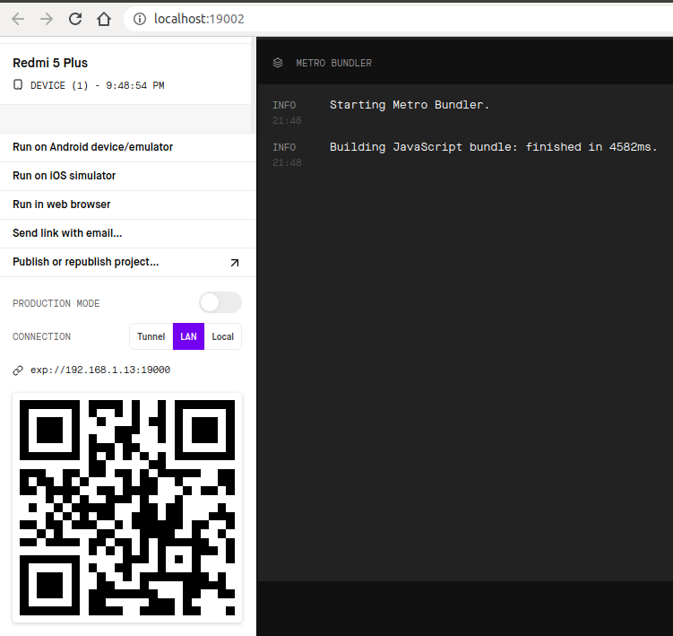
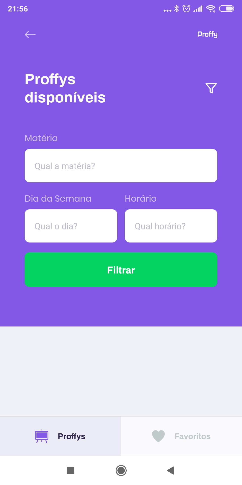

<h1 align="center">
   
</h1>

<h4 align="center">
   <strong> 
	🚀 <a href='https://rocketseat.com.br/'>Rocketseat</a> - NextLevelWeek 2.0 🚀 Em desenvolvimento... 🚧
   </strong>
</h4>

<p align="center">
   

   

   

   <a href="https://github.com/rafaelsholanda/Proffy/stargazers">
   
   

   
   </a>

   <a href="https://github.com/rafaelsholanda/Proffy/issues">
      
   </a>

   

   <a href="https://github.com/rafaelsholanda/Proffy/blob/master/LICENSE.md">
      
   </a>

</p>

<h3 align="center">📚 Proffy é uma plataforma on-line que ajuda alunos a encontrar professores particulares 👨‍🏫 </h3>

# Objetivo do Repositório

Essa aplicação foi proposta e desenvolvida durante o evento **Next Level Week 2.0** da [Rocketseat](https://rocketseat.com.br/), ocorrido entre os dias 3 e 7 de Agosto de 2020. Este repositório se propõe a demonstrar a utilização das diversas tecnologias apresentadas no evento na construção de uma aplicação completa, do back-end ao front-end web e mobile. A aplicação não está finalizada e este repositório ainda encontra-se em desenvolvimento.

> O NLW - Next Level Week é um evento on-line promovido pela [Rocketseat](https://github.com/rocketseat) onde uma aplicação é desenvolvida do zero no período de uma semana. Ao final do NLW o conteúdo não fica mais disponível.

**[#nextlevelweek](https://github.com/search?q=%23nextlevelweek)**

# Índice

   * [Objetivo do Repositório](#Objetivo-do-Repositório)
   * [Índice](#Índice)
   * [Sobre o Projeto](#Sobre-o-Projeto)
      * [Tecnologias](#Tecnologias)
      * [Instalação](#Instalação)
         * [Web](#Web)
         * [Server](#Server)
         * [Mobile](#Mobile)
      * [Como Usar](#Como-Usar)
      * [Features](#Features)
      * [Demonstração da Aplicação](#Demonstração-da-Aplicação)
         * [Screenshots](#Screenshots)
   * [Licença](#Licença)

# Sobre o Projeto

O **Proffy** é uma plataforma para conectar alunos aos professores que fornecem aulas particulares. 

Através da aplicação web os professores irão disponibilizar: 
   - Uma curta descrição própria ou biografia;
   - Os dias e horários disponíveis para as aulas; 
   - A máteria que leciona; 
   - O preço da hora-aula;
   - Um telefone para contato através do WhatsApp. 

Os alunos interessados podem acessar a plataforma web, ou mobile, e realizar a busca dos professores filtrando pela matéria, dia da semana e horários disponíveis.

O projeto possui 3 módulos principais, [server](./server), [web](./web) e [mobile](./mobile).

   - **Server**: back-end da aplicação que contém o banco de dados e a API para comunicação com as rotas por meio das requisições dos clientes (front-end web e mobile). Escrito em [Typescript](https://www.typescriptlang.org/).

   - **Web**: front-end web que contém as páginas do módulo web. O design desse módulo foi escrito priorizando o desempenho mobile (*mobile first web design*) com responsividade para desktop escrito com base no [React](https://reactjs.org/).

   - **Mobile**: é o módulo do App desenvolvido usando o [React-Native](https://reactnative.dev/).

## Tecnologias

A tabela abaixo resume as tecnologias que foram utilizadas para o desenvolvimento da aplicação:

Tecnologia | Descrição
:---------:|:---------
[Axios](https://github.com/axios/axios) | Cliente HTTP  para aplicações **WEB** e **Node** baseado em *promises*.
[Expo](https://expo.io/) | Framework para desenvolvimento de aplicações usando **React**.
[Express](https://expressjs.com/) | Framework web para gerenciamento de rotas no **Node.js**.
[Insomnia](https://insomnia.rest/) | Software que auxilia a debugar a aplicação por meio de *requests* personalizadas.
[Knex](http://knexjs.org/) | Construtor de consultas em SQL para os principais tipos de bancos de dados.
[Node](https://nodejs.org/) | Runtime do JavaScript para desenvolvimento de aplicações web escaláveis e com eventos assíncronos.
[React](https://reactjs.org/) | Biblioteca Javascript para desenvolvimento de interfaces de usuário.
[React-Native](https://reactnative.dev/) | Biblioteca Javascript para desenvolvimento de interfaces nativas de aplicativos usando o **React**.
[TypeScript](https://www.typescriptlang.org/) | Liguagem baseada no JavaScript com o recurso de tipagem para escalabilidade dos projetos.
[Yarn](https://yarnpkg.com/) | Gerenciador de pacotes e dependências do projeto.

## Instalação

Esse tópico descreve as etapas requeridas para testar o projeto em um computador. Em razão da divisão em três módulos é importante executar o back-end, que é o módulo [*server*](#Server), e mantê-lo rodando antes de executar o módulo [*web*](#Web) ou o módulo [*mobile*](#Mobile), sendo os dois últimos *front-ends* independentes entre si e que se comunicam com o *server*. Os exemplos descritos abaixo utilizam o gerenciador de pacotes [Yarn](https://yarnpkg.com/), mas também pode ser utilizado o [NPM](https://www.npmjs.com/).

> Para executar essa aplicação no computador é necessário ter o [Git](https://git-scm.com/), o [Node](https://nodejs.org/) e o [Expo-cli](https://expo.io/) instalados. Além disso é recomendado instalar o aplicativo Expo no seu smartphone [Android](https://play.google.com/store/apps/details?id=host.exp.exponent&referrer=www) ou [IOS](https://itunes.apple.com/app/apple-store/id982107779).

### Server

Para rodar o servidor execute as etapas a seguir:

   1. Clone o repositório do Github para uma pasta no seu computador através do Git:
      ```zsh
         $ git clone https://github.com/rafaelsholanda/proffy
      ```
   1. Instale as dependências dentro da pasta **server**:
      ```zsh
         $ cd Proffy/server
         
         $ yarn install
      ```
   1. Para executar o servidor use o script:
      ```zsh
         $ yarn start
      ```


O servidor vai ficar rodando na porta 3333 e pode ser acessado através da URL http://localhost:3333. Os testes de comunicação com o servidor podem ser realizados através do [Insominia](https://insomnia.rest/). Use o arquivo [Insomnia_resquests.json](./Insomnia_requests.json) para efetuar os testes.

### Web

Para inicializar a interface **web** é necessário manter o back-end (**server**) em execução e proceder da seguinte forma:

   1. Instalar as dependências do módulo:
       ```zsh
         $ cd Proffy/web
         
         $ yarn install
      ```
   1. Para executar o módulo use o script:
      ```zsh
         $ yarn start
      ```



A interface Web vai ficar em execução na porta 3000: http://localhost:3000/.

<p align="center">
   
</p>

### Mobile

Para executar a interface **mobile** é necessário manter o back-end (**server**) em execução e em seguida seguir as etapas:

   1. Instalar as dependências do módulo:
      ```zsh
         $ cd Proffy/web
         
         $ yarn install
      ```
   1. Para executar o módulo use o script:
      ```zsh
         $ yarn start
      ```


Para abrir uma instância da aplicação no smartphone primeiro deve-se scanear o QR-code que será gerado durante a inicialização através do aplicativo **Expo**. O aplicativo não vai conseguir se conectar ao banco de dados pois é necessário corrigir o endereço da aplicação no arquivo [api.ts](./mobile/src/services/api.ts) localizado no endereço [./mobile/src/services/api.ts](./mobile/src/services/api.ts). 

Nesse arquivo você precisar substituir o **baseURL** pelo endereço da aplicação indicado na instância do Expo mantendo a porta '3333': 

   ``` TypeScript
      import axios from 'axios';

      const api = axios.create({
         baseURL: 'http://192.168.1.13:3333'
      });

      export default api;
   ```
> exp://192.168.1.13:19000

<p align="center" >
   
</p>

Por exemplo, se o endereço indicado na instância do Expo for:

> exp://192.168.1.13:19000

Então a variável **baseURL** deverá ser: 

   ```Typescript
      baseURL: 'http://192.168.1.13:3333'
   ```

## Como Usar

A 

## Features
## Demonstração da Aplicação

### Screenshots

A seguir seguem algumas telas da aplicação mobile:

<p align="center" style="display: flex; align-items: flex-start; justify-content: center;">

    

   

   

   

   

</p>

# Licença

Este projeto está sobre a [licença MIT](./LICENSE.md).

[Me mande um e-mail](rafaelholanda3105@gmail.com) ou [fale comigo no Linkedin](https://www.linkedin.com/in/rafaelsholanda/)